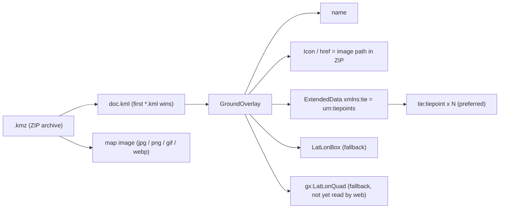

# KMZ File Format

Custom Maps stores every georeferenced map as a `.kmz`. Files written by the web app must stay
readable by the original Custom Maps Android app (and vice versa), so this document records the
exact schema the Android app used. It was captured from the Android source
(`KmlParser.java` and `create/MapEditor.java`) before that code was removed from this repo; see
git history before the Android removal if you need to consult it.



## Archive layout

```
map.kmz
├── doc.kml
└── map.jpg          # Android wrote images under images/<name>.jpg — both work
```

The `<href>` is a path relative to the KML file. The web reader also falls back to a
case-insensitive basename match.

## KML written by the Android app

```xml
<?xml version="1.0" encoding="UTF-8"?>
<kml xmlns="http://www.opengis.net/kml/2.2"
     xmlns:gx="http://www.google.com/kml/ext/2.2">
<GroundOverlay>
  <name><![CDATA[My map]]></name>
  <description><![CDATA[]]></description>
  <Icon>
    <href>images/my_map.jpg</href>
  </Icon>
  <LatLonBox>
    <north>31.780000</north>
    <south>31.770000</south>
    <east>35.240000</east>
    <west>35.225000</west>
    <rotation>1.50</rotation>
  </LatLonBox>
  <ExtendedData xmlns:tie="urn:tiepoints">
    <tie:tiepoint>
      <tie:image>12,34</tie:image>
      <tie:geo>35.230000,31.778000</tie:geo>
    </tie:tiepoint>
    <!-- … one per tiepoint … -->
  </ExtendedData>
</GroundOverlay>
</kml>
```

Instead of `<LatLonBox>` the Android app could write
`<gx:LatLonQuad><coordinates>` with four `lon,lat,0` corners in the order SW, SE, NE, NW.

## Compatibility rules

| Rule | Why |
|---|---|
| Tiepoint element names must be literally `tie:tiepoint`, `tie:image`, `tie:geo` | The Android parser matches on the **prefixed name**, not the namespace URI |
| `tie:image` is `x,y` **integers** | Android parses with `Integer.parseInt` — a decimal pixel crashes it |
| `tie:geo` is `lon,lat` (longitude first) | Same order as KML `<coordinates>` |
| Separator may be comma or whitespace | Both parsers split on `[\s,]+`; we write commas, like Android |
| `xmlns:tie="urn:tiepoints"` | Matches what Android wrote |
| `<GroundOverlay>` may sit directly under `<kml>` or inside `<Document>`/`<Folder>` | Both parsers accept either |
| Always **write** tiepoints; always **read** tiepoints *and* `LatLonBox` | Tiepoints are exact; `LatLonBox` is for Google Earth and other KML readers |

The web implementation lives in `src/io/KmzWriter.ts` (`buildKml`) and
`src/io/KmzReader.ts` (`parseKml`). `src/io/Kml.test.ts` contains an Android-format
fixture — keep it passing.
