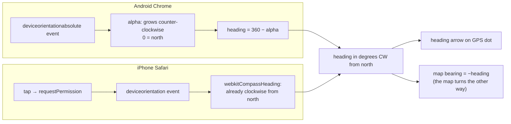

# Compass on phones

Two features need "which way is the phone facing": the heading arrow on your location dot
(`leaflet.locatecontrol`) and follow-compass rotation (`leaflet-rotate`). Android and iPhone
report it differently.



## The three gotchas

1. **`alpha` runs the "wrong" way.** Compass headings go clockwise (east = 90). `alpha` goes
   counter-clockwise, so facing east gives `alpha = 270`. Heading is `360 − alpha`.
2. **iPhone has no `deviceorientationabsolute`.** It fires plain `deviceorientation` with an
   extra `webkitCompassHeading` that is already a normal heading. Code listening only to the
   Android event never hears from an iPhone. This is exactly what failed in CI on PR #7.
3. **iPhone asks permission first.** `DeviceOrientationEvent.requestPermission()` must be called
   from a tap. The app calls it when you tap *Show my location* or the rotate button.

## Why the map turns by `alpha`

If you face east (heading 90), east must point up the screen, so the map turns 90°
counter-clockwise: bearing −90, which is the same as 270 — the same number as `alpha`. That's
why `leaflet-rotate` calls `setBearing(alpha)` on Android and `setBearing(360 − webkitCompassHeading)`
on iPhone.

## Simulating it in tests

Playwright can't tilt a phone, so tests fire the event themselves, in the right shape per
browser (see `e2e/mapview.spec.ts`):

```ts
window.dispatchEvent(isIos
  ? Object.assign(new Event('deviceorientation'), { alpha: 0, webkitCompassHeading: 180, webkitCompassAccuracy: 10 })
  : Object.assign(new Event('deviceorientationabsolute'), { alpha: 180, absolute: true }));
```

Both plugins throttle these events, so tests send them repeatedly inside `expect(...).toPass()`
rather than once.
