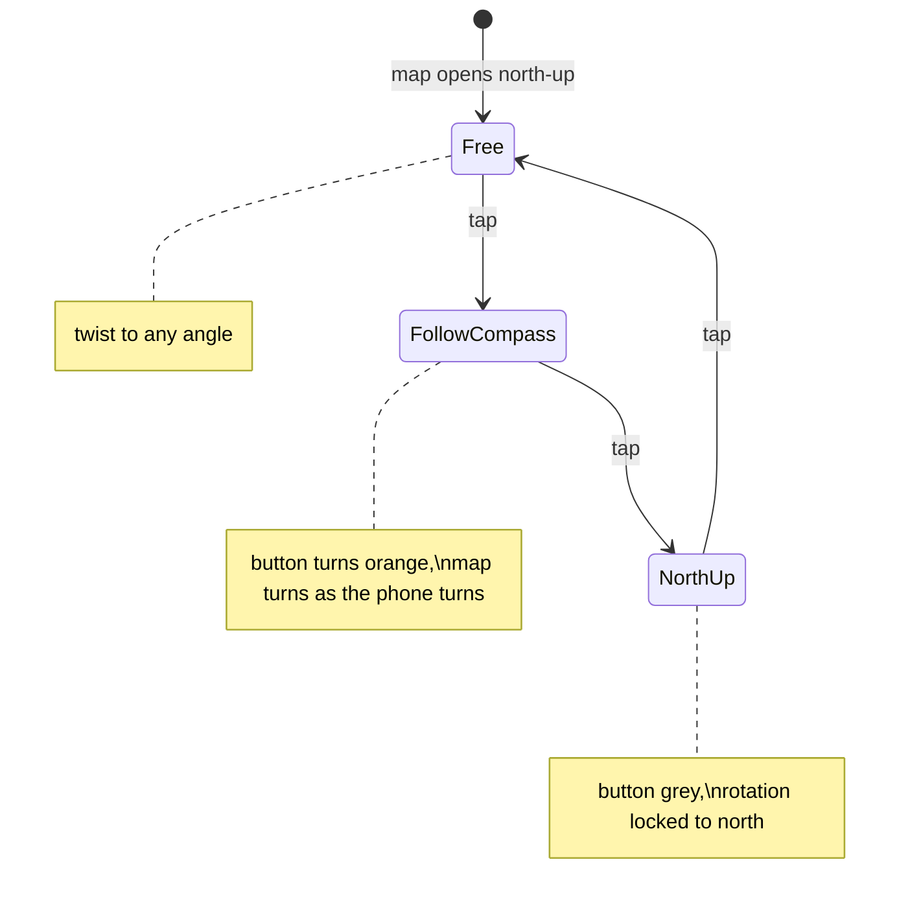
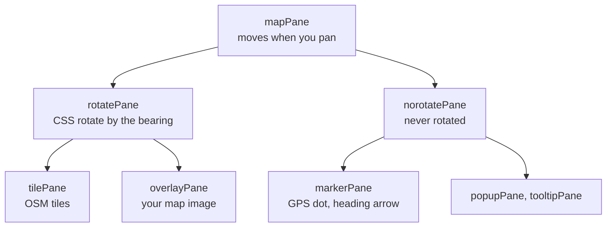

# Map rotation

Leaflet can't rotate a map on its own. The app adds the
[`leaflet-rotate`](https://github.com/Raruto/leaflet-rotate) plugin (GPL-3.0), switched on in
`src/ui/MapView.ts`:

```ts
L.map(div, { rotate: true, touchRotate: true,
             rotateControl: { position: 'topright', closeOnZeroBearing: false } });
```

## What you can do

- **Two-finger twist** turns the map. On desktop: Shift + scroll.
- **The arrow button** (top right) always points north. Each tap moves to the next mode:



## How it works: panes

A Leaflet map is a stack of HTML layers called *panes*. `leaflet-rotate` splits them in two:
one group spins, the other stays upright.



- **Tiles and your map image** live in the same rotated pane, so they always turn together and
  stay aligned. The custom `RotatedImageLayer` needed no change: it places the image with
  `latLngToLayerPoint`, which is measured *inside* the rotated pane.
- **Markers stay upright** so text and icons stay readable. That is a trap for anything whose
  angle means something: the GPS heading arrow is drawn relative to north, so on a rotated map
  it would point the wrong way. The fix is one option in `src/ui/locate.ts`:
  `compassStyle: { rotateWithView: true }` — rotate this marker by the map's bearing too.

## Bearing

*Bearing* = how many degrees the map is turned. `map.setBearing(180)` puts south at the top.
`leaflet-rotate` applies it as `transform: rotate(...)` on `rotatePane`, pivoting around the
screen centre. The e2e test reads that CSS transform back to check the angle.

## Dark mode

The rotate button's arrow is an inline dark SVG from the plugin, invisible on the dark button.
`src/styles.css` inverts it: `.wa-dark .leaflet-control-rotate-arrow { filter: invert(1); }`.
The orange/grey button colours are inline styles set by the plugin.

## Known limits

- The plugin was last released in 2023 (0.2.8). It patches Leaflet internals, so a Leaflet 2.x
  upgrade will likely break it.
- The bearing isn't remembered between visits.
