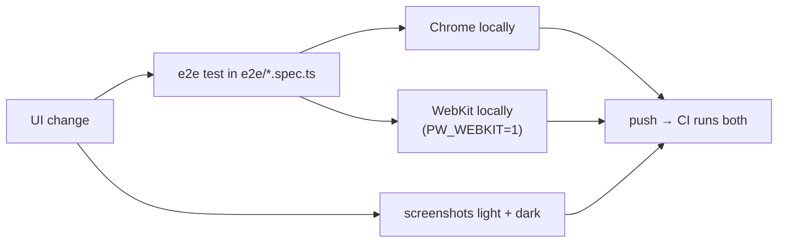

# Testing on both phones

CI runs every e2e test twice: **Android Chrome** (Pixel 10, 360 px) and **iPhone Safari**
(WebKit, iPhone SE). Locally only Chrome runs by default, which is how an iPhone-only failure
can reach CI.

## Run the iPhone tests locally (Linux / Claude Code on the web)

```sh
npx playwright install webkit
npx playwright install-deps webkit     # system libraries; needs root, ~2 min
PW_WEBKIT=1 npm run test:e2e
```

In a Claude Code web session, also set the Chromium path if the SessionStart hook didn't:
`export PLAYWRIGHT_CHROMIUM_EXECUTABLE=/opt/pw-browsers/chromium`.

## Look at it, don't guess

For any visual change take screenshots at 360 × 732 in **both** colour schemes and look at
them. Rotation bugs (wrong direction, image drifting off the tiles, invisible arrow in dark
mode) are obvious in a picture and invisible in the DOM.



A throwaway screenshot spec (delete it before committing) is the quickest way: open the map,
`page.screenshot({ path })`, then `browser.newContext({ colorScheme: 'dark' })` for the second.

## No unit tests — so how is the math tested?

The project has only Playwright tests. Pure logic is checked through what a user would notice:

| Logic | Checked by |
|---|---|
| Tiepoint fit (`GeoToImageConverter`, `DMatrix`) | `georeference.spec.ts`: stand at a spot, the GPS dot must land on the image pixel showing it |
| KML read/write | `kmz.spec.ts` opens Android and plain-KML files; `editor.spec.ts` exports a map and reads it back |
| Saved data (`MapStore`, `Prefs`) | `storage.spec.ts`: old record formats, corrupt or blocked storage, unreadable files |
| Upload quota (`api/upload.ts`) | `upload-quota.spec.ts` checks the rule directly — the Vercel Function isn't served in tests |

A test is only worth having if it fails when the code breaks. When adding one, break the code on
purpose (e.g. swap lat/lon in `KmzWriter.ts`) and watch it go red before trusting it.
